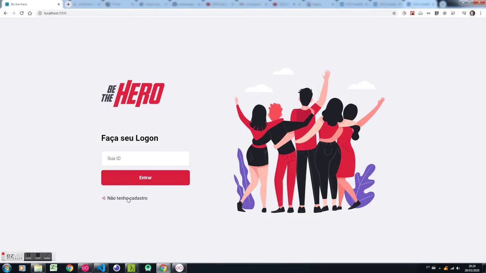

# 11ª Semana Omnistack
> Renovando e aprendendo sempre. Obrigado a equipe da Rocketseat por porporcionar essa ótima semana de apredizagem.

### D5 Apps | Você mais perto do seu Cliente
> Acreditar e buscar novas tecnologias e novos conhecimento nunca deixando se acomodar isso é ser um Dev

[![NPM Version][npm-image]][npm-url]
[![Build Status][travis-image]][travis-url]
[![Downloads Stats][npm-downloads]][npm-url]

Desenvolvimento de uma aplicação completa passando pela API em node, FrontEnd em ReactJS e finalizando no App mobile usando o react.js

1. Faça o _fork_ do projeto (<https://github.com/diogofranco85/omnistack11>)
2. Crie uma _branch_ para sua modificação (`git checkout -b feature/fooBar`)
3. Faça o _commit_ (`git commit -am 'Add some fooBar'`)
4. _Push_ (`git push origin feature/fooBar`)
5. Crie um novo _Pull Request_

[npm-image]: https://img.shields.io/npm/v/datadog-metrics.svg?style=flat-square
[npm-url]: https://npmjs.org/package/datadog-metrics
[npm-downloads]: https://img.shields.io/npm/dm/datadog-metrics.svg?style=flat-square
[travis-image]: https://img.shields.io/travis/dbader/node-datadog-metrics/master.svg?style=flat-square
[travis-url]: https://travis-ci.org/dbader/node-datadog-metrics
[wiki]: https://github.com/seunome/seuprojeto/wiki
